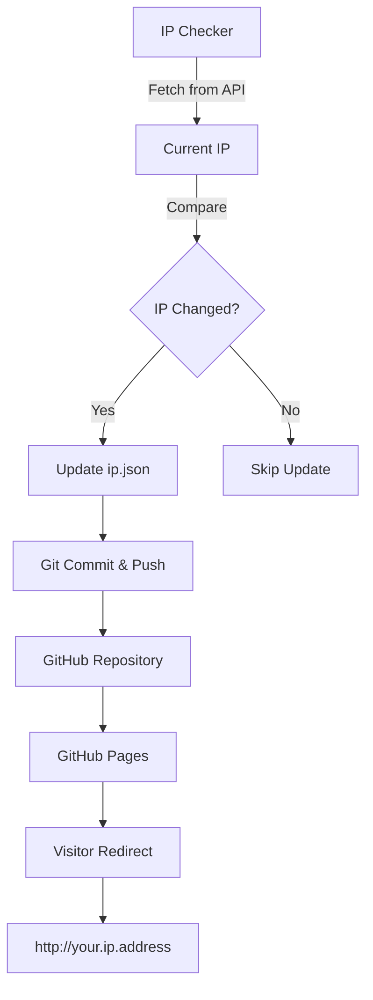

# Dynamic DNS with GitHub Pages

A TypeScript-based dynamic DNS solution that monitors your public IP address and automatically updates a GitHub Pages site to redirect visitors to your current IP.

## Table of Contents

1. [Overview](#1-overview)
2. [Features](#2-features)
3. [Architecture](#3-architecture)
4. [Prerequisites](#4-prerequisites)
5. [Installation](#5-installation)
6. [Configuration](#6-configuration)
7. [Deployment Methods](#7-deployment-methods)
   - [7.1 Long-Running Process (Daemon)](#71-long-running-process-daemon)
   - [7.2 Cron Job](#72-cron-job)
   - [7.3 Docker Container](#73-docker-container)
   - [7.4 GitHub Actions](#74-github-actions)
8. [GitHub Pages Setup](#8-github-pages-setup)
9. [Project Structure](#9-project-structure)
10. [Development](#10-development)
11. [Troubleshooting](#11-troubleshooting)
12. [License](#12-license)

---

## 1. Overview

This project automatically:
1. Polls your public IP address at configurable intervals
2. Detects IP address changes
3. Updates a JSON file in the repository
4. Commits and pushes changes to GitHub
5. Serves a GitHub Pages site that redirects visitors to your current IP

---

## 2. Features

✓ **TypeScript** - Type-safe, maintainable code
✓ **Configurable Polling** - Set check interval via environment variable
✓ **Multiple Deployment Options** - Daemon, cron, Docker, or GitHub Actions
✓ **Automatic Git Integration** - Commits and pushes IP changes
✓ **GitHub Pages Redirect** - Simple HTTP redirect to your current IP
✓ **Zero External Dependencies** - Redirect page uses pure HTML/JavaScript
✓ **Error Handling** - Comprehensive error handling and logging

---

## 3. Architecture



**Components:**
- **TypeScript Client**: Monitors IP and manages git operations
- **docs/ip.json**: Stores current IP and timestamp
- **docs/index.html**: GitHub Pages redirect page
- **GitHub Actions**: Optional cloud-based execution

---

## 4. Prerequisites

- Node.js 20+ (for local/cron deployment)
- Git with push access to this repository
- Docker (optional, for containerized deployment)
- GitHub account with Pages enabled

---

## 5. Installation

### Clone and Install

```bash
git clone <your-repo-url>
cd dynamic-dns-gh-pages
npm install
```

### Build the Client

```bash
npm run build
```

---

## 6. Configuration

### Environment Variables

Copy `env.template` to `.env` and configure:

```bash
cp env.template .env
```

**Available Options:**

| Variable | Default | Description |
|----------|---------|-------------|
| `POLL_INTERVAL_MINUTES` | `15` | How often to check IP (in minutes) |
| `IP_API_URL` | `https://api.ipify.org?format=json` | API endpoint for IP detection |
| `GIT_USER_NAME` | `Dynamic DNS Bot` | Git commit author name |
| `GIT_USER_EMAIL` | `bot@dynamic-dns.local` | Git commit author email |
| `IP_DATA_FILE_PATH` | `docs/ip.json` | Path to IP data file (optional) |

**Alternative IP APIs:**
- `https://api.ipify.org?format=json`
- `https://ifconfig.me/all.json`
- `https://api.my-ip.io/ip.json`

---

## 7. Deployment Methods

### 7.1 Long-Running Process (Daemon)

Run as a continuous background process:

```bash
npm run daemon
```

This will:
- Check IP immediately
- Poll every `POLL_INTERVAL_MINUTES` minutes
- Run until stopped (Ctrl+C)

**Use with Process Manager (pm2):**

```bash
npm install -g pm2
pm2 start npm --name "dynamic-dns" -- run daemon
pm2 save
pm2 startup
```

---

### 7.2 Cron Job

Run as a scheduled task using cron:

1. **Make script executable:**
   ```bash
   chmod +x scripts/run-once.sh
   ```

2. **Add to crontab:**
   ```bash
   crontab -e
   ```

3. **Add entry (runs every 15 minutes):**
   ```cron
   */15 * * * * /path/to/dynamic-dns-gh-pages/scripts/run-once.sh
   ```

4. **Create logs directory:**
   ```bash
   mkdir -p logs
   ```

---

### 7.3 Docker Container

Run in a containerized environment:

#### Build and Run

```bash
docker-compose up -d
```

#### View Logs

```bash
docker-compose logs -f
```

#### Stop Container

```bash
docker-compose down
```

**Docker Setup Requirements:**

1. **SSH Keys** (for git push):
   ```bash
   mkdir -p ssh-keys
   cp ~/.ssh/id_rsa ssh-keys/
   cp ~/.ssh/id_rsa.pub ssh-keys/
   ```

2. **Configure Environment:**
   Edit `docker-compose.yml` or create `.env` file

---

### 7.4 GitHub Actions

Run automatically in the cloud (no local client needed):

**Setup:**

1. GitHub Actions workflow is already configured in `.github/workflows/update-ip.yml`
2. Runs every 15 minutes automatically
3. No additional configuration needed

**Manual Trigger:**

Go to Actions tab → "Update IP Address" → "Run workflow"

**Adjust Schedule:**

Edit `.github/workflows/update-ip.yml` and change the cron expression:

```yaml
schedule:
  - cron: '*/15 * * * *'  # Every 15 minutes
```

**Note:** GitHub Actions won't detect IP changes of your local machine - only the IP of GitHub's runners. Use this method only if you want to track GitHub's infrastructure IP or if running a webhook/API to report your actual IP.

---

## 8. GitHub Pages Setup

### Enable GitHub Pages

1. Go to repository **Settings**
2. Navigate to **Pages** section
3. Under **Source**, select:
   - **Branch**: `main`
   - **Folder**: `/docs`
4. Click **Save**

### Access Your Site

After enabling Pages, your site will be available at:

```
https://<your-username>.github.io/<repo-name>/
```

The page will automatically redirect visitors to `http://<your-current-ip>`

---

## 9. Project Structure

```
dynamic-dns-gh-pages/
├── client/                          # TypeScript client
│   ├── src/
│   │   ├── index.ts                # Main entry point
│   │   ├── ip-checker.ts           # IP detection logic
│   │   ├── git-updater.ts          # Git operations
│   │   ├── config.ts               # Configuration management
│   │   └── types.ts                # TypeScript interfaces
│   ├── package.json                # Client dependencies
│   ├── tsconfig.json               # TypeScript configuration
│   └── Dockerfile                  # Docker build instructions
├── docs/                            # GitHub Pages content
│   ├── index.html                  # Redirect page
│   └── ip.json                     # Current IP data
├── .github/
│   └── workflows/
│       └── update-ip.yml           # GitHub Actions workflow
├── scripts/
│   └── run-once.sh                 # Cron execution script
├── docker-compose.yml              # Docker Compose configuration
├── env.template                    # Environment variables template
├── package.json                    # Root workspace configuration
├── .gitignore                      # Git ignore patterns
└── README.md                       # This file
```

---

## 10. Development

### Build

```bash
npm run build
```

### Run Once (Single Check)

```bash
npm run once
```

### Watch Mode (Auto-rebuild)

```bash
cd client
npm run dev
```

### Clean Build Artifacts

```bash
cd client
npm run clean
```

---

## 11. Troubleshooting

### IP Not Updating

1. **Check logs:**
   ```bash
   # Daemon mode
   docker-compose logs -f

   # Cron mode
   tail -f logs/ip-check.log
   ```

2. **Verify git credentials:**
   ```bash
   git config user.name
   git config user.email
   ```

3. **Test git push manually:**
   ```bash
   git push
   ```

### GitHub Pages Not Redirecting

1. **Verify Pages is enabled** in repository settings
2. **Check `docs/ip.json` exists** and has valid content
3. **Wait 1-2 minutes** for Pages to rebuild
4. **Check browser console** for JavaScript errors

### Permission Errors

**Docker SSH Issues:**

```bash
# Ensure SSH keys have correct permissions
chmod 600 ssh-keys/id_rsa
chmod 644 ssh-keys/id_rsa.pub
```

**Git Push Authentication:**

- For HTTPS: Use personal access token
- For SSH: Ensure SSH keys are configured in GitHub

---

## 12. License

MIT License - Feel free to use and modify as needed.

---

**Questions or Issues?**

Open an issue in this repository for support.
